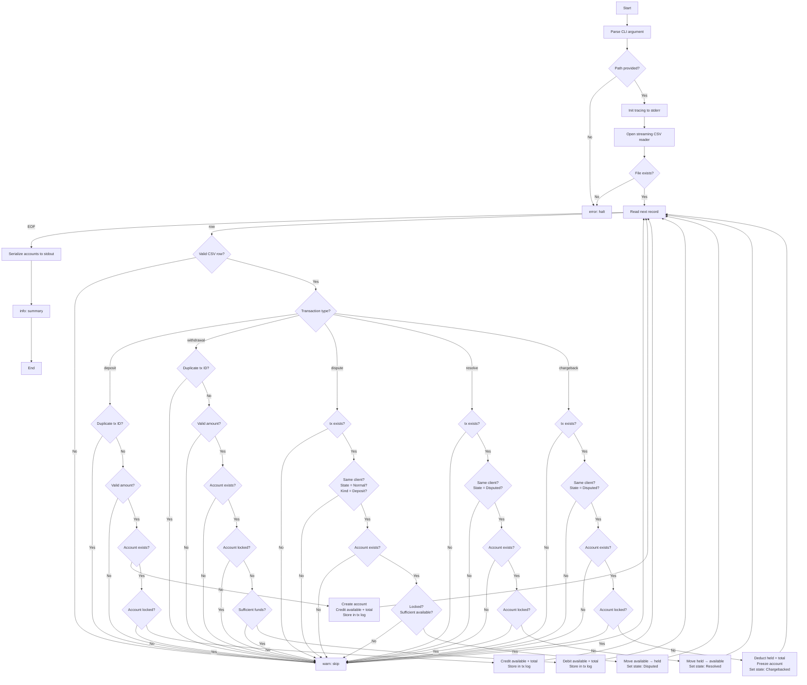

# Simple Payments Engine

## Index

- [Value Normalization](#value-normalization)
- [CLI](#cli)
- [State Machine](#state-machine-disputes)
- [Error Handling](#error-handling)
- [Logging](#logging)
- [Project Model Structure](#project-model-structure)
- [Program Flow](#program-flow)
- [Tests](#tests)

## Value Normalization

<details>
<summary> Click here </summary>

Since the maximum decimals we will ever have is 4 then we will store/work with values internally as i64 where **1 unit == 0.0001**. 

The advantages of this approach: 

1. no extra dependencies,

2. eliminating rounding surprises,

3. integer arihtmetic is faster.

The cons are outweighed by the benefits:

1. the i64 overflow (mitigated by using checked arithmetic),

2. having to write more code to parse and format. 

</details>

---

## CLI

<details>
<summary> Click here </summary>

For the CLI argument parsing, while **clap** would seem like the solid choice, given that the command is `cargo run -- transactions.csv` we only have one positional argument. Thus making the use of clap overkill as we have no need for complex argument parsing or even --help generation. 

As such the argument parsing just uses `std::env::args()` from **stdlib**.

</details>

---

## State Machine (Disputes)

<details>
<summary> Click here  </summary>

A tx can be either,

- Normal
- Disputed
- Resolved (returns to normal state)
- Chargebacked (terminal state)

### Q&A

> **PREMISE:** We are operating under the perspective of a Bank.

1. Q: Can a withdrawal be disputed?

 - A: As banks only dispute credits therefore only deposits are disputable.

2. Q: Can a frozen account receive deposits? 

 - A: Since the account is frozen all incoming transactions are rejected.

3. Q: What if a dispute references a transaction belonging to a different client?

- A: Rejected. No bank would allow client A to dispute a transaction belonging to client B.

4. Q: Duplicate transaction ID, should we ignore or error?

- A: Reject and skip. A transaction ID is unique therefore either its a data error or a replay attempt both treated the same way. 

5. Q: Deposit partially spent before the dispute was filed, what to do? 

- A: For this edge case the decision was to dismiss the request since a scenario like this would lead to negative balance. The client must ensure the minimum balance before requesting the operation.

6. Q: Can a resolved transaction be disputed again?

A: No. Once resolved, the transaction leaves the Disputed state and cannot re-enter it. In a production system a new dispute would be a separate workflow, but for this engine each deposit gets at most one dispute lifecycle.

> **Note:** In a production system this would be an observability flagged event that would incur human revision. 

</details>

---

## Error Handling

<details>
<summary> Click here </summary>

Errors are handled by two crates,

- **thiserror**: this crate is used on the engine and models level for typed and domain specific errors with meaning i.e (Account Frozen or Insufficient Funds),

- **anyhow**: is used on the main.rs only for tackling I/O errors such as the CSV parse failures, file not found and write failures as these will just be propagated and displayed.

</details>

---

## Logging

<details>
<summary> Click here </summary>

For logging the choice is the **tracing** crate with the subscriber writing to the stderr (as stdout is reserved for the CSV output).

Levels: 

- **WARN**: applied to expected edge cases such as skipped transactions (frozen account, insufficient funds, unknown tx reference).

- **INFO**: emits progress on program checkpoints and a summary on completion. Silent otherwise, allowing clean runs.


> **Note:** Logs can be enabled by setting the `RUST_LOG` environment variable, e.g. `RUST_LOG=INFO cargo run -- transactions.csv`.

</details>

---

## Project Model Structure

<details>
<summary> Click here </summary>

```
src/
├── lib.rs                      - Library entry point, exposes modules
├── main.rs                     - CLI, wires codec -> engine -> output
├── codec.rs                    - CSV row -> internal types
├── serde_helpers.rs            - Serialize and deserialize amounts
├── models/
│   ├── account.rs              - Account struct
│   ├── stored_transaction.rs   - StoredTransaction, TransactionState, TransactionKind
│   └── transaction.rs          - TransactionType enum, Transaction
└── engine/
    ├── mod.rs                  - Processes transactions, owns accounts + transaction maps
    ├── error.rs                - Typed domain errors
    ├── store.rs                - AccountStore and TransactionStore traits
    └── tests.rs                - Unit tests
tests/
├── integration_tests.rs        - End-to-end fixture tests
└── fixtures/                   - CSV test fixtures

```
</details>

---

## Program Flow

<details>
<summary> Click here </summary>

### Efficiency/Streaming 

The CSV is processed record-by-record and never fully loaded into memory, keeping the engine viable in server contexts handling concurrent streams.

In memory we hold only two structures:

- Accounts (**HashMap<u16, Account>**),

- Transaction Log (**HashMap<u32, StoredTransaction>**).

> **Note:** The Transaction Log stores both deposits and withdrawals — deposits for dispute resolution, withdrawals to guard against replay attacks.

Memory footprint only scales with unique clients and unique transactions (deposits and withdrawals) seen, not total row count.

### Flowchart



</details>

---

## Tests

<details>
<summary> Click here </summary>

Traits abstract storage allowing for mock injection for unit tests. Integration tests exercise the full pipeline end-to-end against fixture CSV files.

> **Note:** To run tests: `cargo test`  
> To run with log output: `cargo test -- --nocapture`

### Unit Tests (`src/engine/tests.rs`)

25 tests organised by transaction type, each asserting the specific error variant returned using `matches!`:

- **deposits_tests** — account creation, credit on existing account, locked account rejection, duplicate tx ID rejection, missing amount rejection.

- **withdrawal_tests** — debit and tx log storage, insufficient funds rejection, locked account rejection, nonexistent account rejection, missing amount rejection, duplicate tx ID rejection.

- **disputes_tests** — funds moved to held, already disputed rejection, nonexistent tx rejection, cross-client rejection, withdrawal tx rejection, insufficient available funds rejection.

- **resolve_tests** — funds returned to available, locked account rejection, not disputed rejection, wrong client rejection.

- **chargeback_tests** — held and total deducted and account locked, not disputed rejection, already locked rejection, wrong client rejection.

### Integration Tests (`tests/integration_tests.rs`)

7 tests covering the full CSV → engine → account state pipeline:

| Fixture | Scenario |
|---|---|
| `dispute_resolve.csv` | Deposit → dispute → resolve restores balance |
| `dispute_chargeback.csv` | Deposit → dispute → chargeback zeroes balance and locks |
| `cross-client_dispute.csv` | Client 2 disputes client 1's tx — rejected, both accounts untouched |
| `frozen_account_rejects_further.csv` | Post-chargeback deposit rejected |
| `withdrawal_dispute.csv` | Dispute on a withdrawal tx — rejected |
| `partial_spend_dispute.csv` | Dispute on partially spent deposit — rejected, insufficient available funds |
| `comprehensive.csv` | 5 clients, all transaction types, chained operations and edge cases |

</details>

---

> **Disclaimer:** AI was used to generate Fixtures to cover execution scenarios, generate the Flowchart of the program, sanity checks on the code and Rubberducking in general.